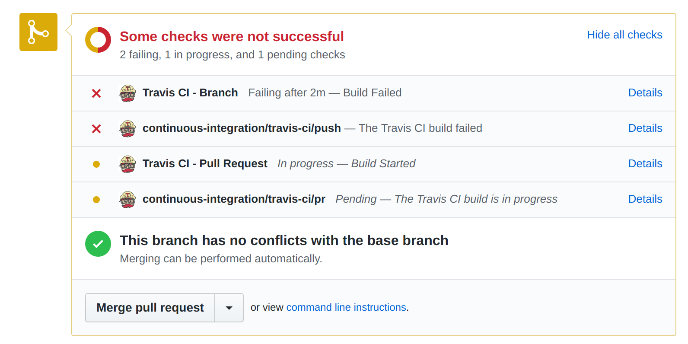
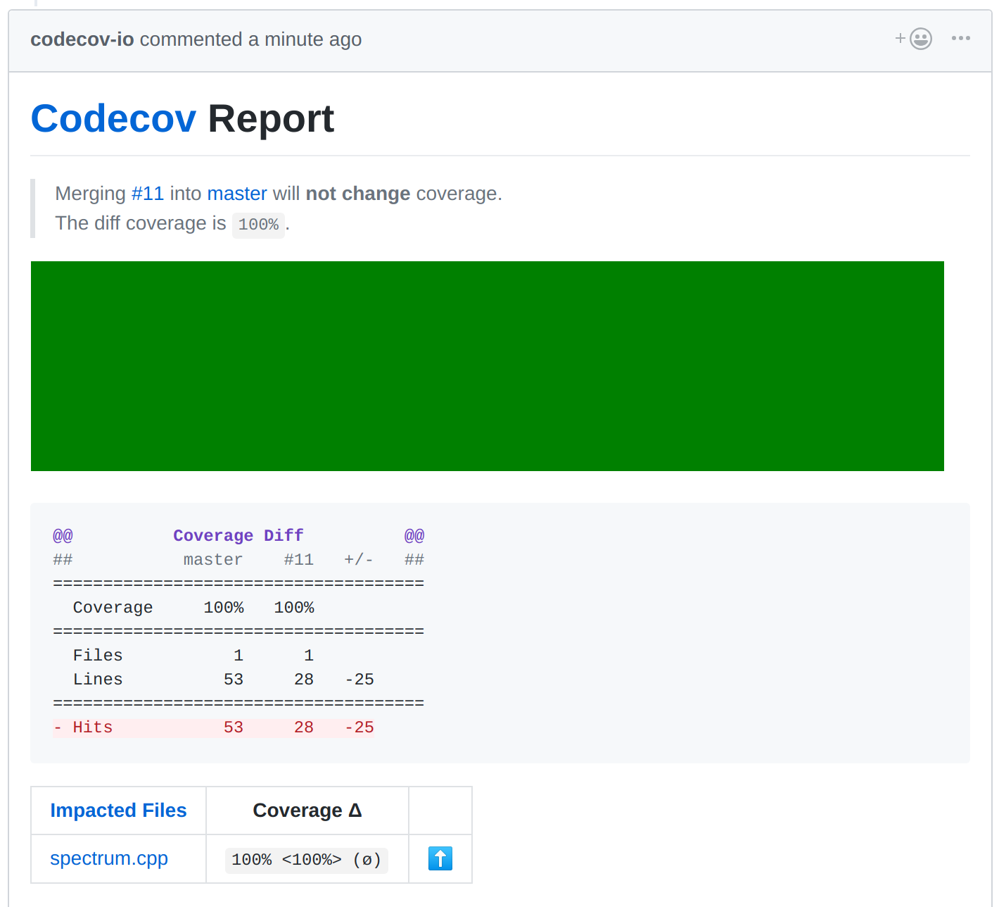

# Travis CI - repo configuration
Create an account with your GitHub login and enable a repo to get started. (Travis Pro appears to enable new repos by default.)

## C++11 - simple builds
If you just want to get something building quickly the default Trusty build
has clang 5 pre-installed, no need for complicated matrices.

Travis config
```YAML
script: clang++ --version
```

Travis build debug
```bash
$ clang++ --version
clang version 5.0.0 (tags/RELEASE_500/final)
```

## C++ builds
Building for clang and gcc. These could be run as separate jobs but you
then have to handle each build attempting to deploy.
```yaml
script:
  - make CXX=clang++-6.0
  - make clean
  - make CXX=g++-8
  - cppcheck --enable=all .
  - sloccount *.cpp

matrix:
  include:
    - os: linux
      addons:
        apt:
          update: true
          sources:
            - ubuntu-toolchain-r-test
            - llvm-toolchain-trusty-8.0
          packages:
            - clang++-8.0
            - g++-8
            - cppcheck
            - sloccount
```
## C++ code coverage
Create a [codecov.io](https://codecov.io/) account with your GitHub credentials and
simply push your coverage files via Travis CI using the generic upload script as
a build stage (no need to enable the repo). Build your C++ using the gcc ```-g --coverage``` flags (which invokes
gcov). Note: I've only managed to get sensible coverage results when compiling with gcc 6.

```yaml
script:
  - bash <(curl -s https://codecov.io/bash)
```

## Branch merge
An unexpected side-effect of using Travis CI is that your branch is automatically built as part of the merge verification.



You're also offered a Codecov report for the merge.


## Deploying to GitHub Pages
In the Travis CI repo settings create a private environment variable "api_key"
containing your GitHub API key. This replaces the ```${api_key}``` below. All
branches are built in Travis CI by default but in this example on the master
branch will be deployed. Deploying for the first time will create a "gh-pages"
branch and set up the username.github.io/repo static web page. I like to
use this to generate "live" READMEs containing recent data.

Create an API key in your [GitHub settings](https://github.com/settings/tokens), tick "repo" and "admin:public_key".

```yaml
deploy:
  provider: pages
  github-token: ${api_key}
  skip-cleanup: true
  on:
    branch: master
```

## bash with dot
```yaml
script: make
install: sudo apt install graphviz
```

## Python with requests
HTTP requests aren't available by default so you must instruct Travis CI to make it so using an additional "requiredments" file.
```yaml
language: python
python: "3.6"
script: make

# This is implicit
# pip install -r requirements.txt
```

Add ```requirements.txt``` file to the top level of your repo containing a list
of dependencies.
```bash
requests
```

# Linting and profiling
To use ```gprof```, compile your code with the ```-pg``` flag, run the exe and then process the results as part of your build script.
```yaml
script:
  - make
  - ./spectrum.o
  - gprof ./spectrum.o
```

To run ```cppcheck```, add it to your apt configuration and simply run as a build stage.
```yaml
script:
  - cppcheck --enable=all .
```

Also ```sloccount``` can be run to give an insight into the cost of your codebase.

# Travis CI - triggering builds using the API
You can configure a hourly cron job via the Travis settings but for more
frequent builds set up your own cron job on a Linux web server and use the
Travis API. Note the .org in the API URL, if you use the wrong one (.com) it
will simply report "access denied". There's a different API key for the Pro
account too. Update ```TOKEN```, ```USERNAME``` and ``` ```REPO``` in the script below (leave the "%2").

```bash
# Travis
@hourly nice ~/trigger.sh
```

```bash
#!/bin/bash

body=$(cat <<!
{
"request": {
"branch":"master",
"message":"cron $(date)"
}}
!
)

curl -s -X POST \
  -H "Content-Type: application/json" \
  -H "Accept: application/json" \
  -H "Travis-API-Version: 3" \
  -H "Authorization: token TOKEN" \
  -d "$body" \
  "https://api.travis-ci.org/repo/USERNAME%2FREPO/requests" >& /dev/null
```

# Clang format on pre-commit
I use a global git configuration that runs clang-format on all C++ files as they are pushed to the server. See [githooks](https://github.com/deanturpin/githooks). I've changed my mind about coding standards many times over the years, next time I can just create a new format configuration and run it over my code. This also avoids you having to spend time pondering how to format bracket-heavy features like lambdas and initialiser lists.

```bash
for file in $(git diff-index --cached --name-only HEAD); do
  if [[ $file == *.cpp || $file == *.h ]]; then
    clang-format -i "$file"
    git add "$file"
  fi
done
```

# Compiler options
```bash
# Standard
--std=c++17 --all-warnings --extra-warnings --pedantic-errors

# Warnings that are not included by *all* and *extra*
-Werror -Wshadow -Wfloat-equal -Weffc++ -Wdelete-non-virtual-dtor

# Profiler
-pg

# Code coverage (gcc only, ignored by clang)
-g --coverage
```

# Uptime monitoring
See [uptime robot](https://stats.uptimerobot.com/V7YEVs8gv).

# References
* https://docs.travis-ci.com/user/languages/cpp/
* https://arne-mertz.de/2017/04/continuous-integration-travis-ci/
